<picture>
  <source media="(prefers-color-scheme: dark)" srcset="card-dark-anim.svg">
  
</picture>

##  projects

- [bid-pricing-collusion](https://github.com/linusc9516/bid-pricing-collusion): do LLM bidders learn to take turns winning sealed-bid auctions? 190 sessions across three models, no rotation found so far, further investigation continues.
- [Soular](https://github.com/endernoke/soular): a mobile app where youths plan, organise and publicise environmental events in one place. Team hackathon project built using React Native and Supabase, with an event feed, group chat and an AI copilot. Placed 2nd and won the Innovation Award at JA Code for Impact 2025.

##  contact

[LinkedIn](https://linkedin.com/in/linusc9516) · [X](https://x.com/linusc9516) · linusc9516 [at] gmail [dot] com
<!-- TODO: add personal site/blog link once it is refurbished -->
